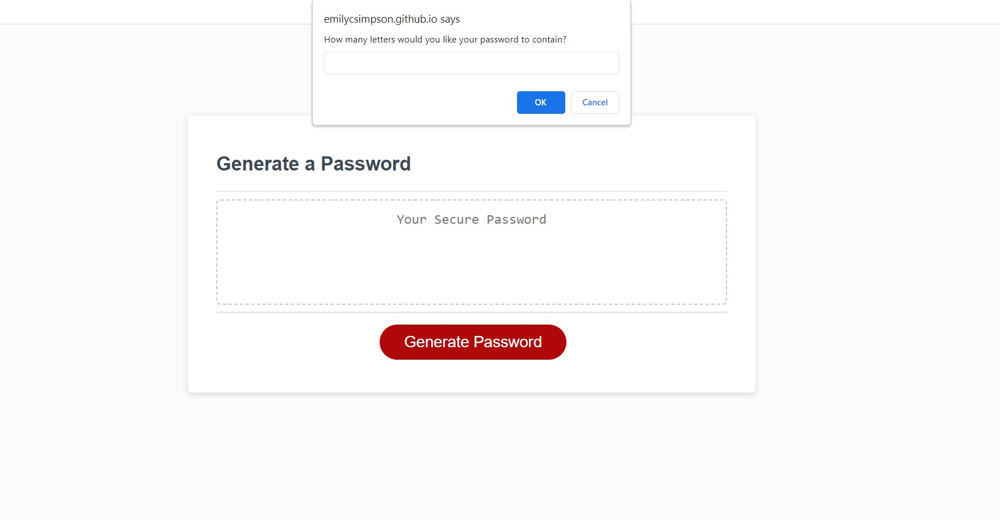

# Module 5 Challenge: Password Generator

## Overview
 
For this week’s challenge we had to create an application that generated a random password based on user input - password length as well as what characters they wanted including in their password. The CSS and HTML files were provided for us, as well as a script with pre-existing arrays and some functions - we just had to write the code to execute. 

## Acceptance criteria

* Generate a password when the button is clicked (this is actually done at the end, after the user has input their criteria)
  * Present a series of prompts for password criteria:
    * Length of password
      * At least 8 characters but no more than 128.
    * Character types
      * Lowercase
      * Uppercase
      * Numeric
      * Special characters ($@%&*, etc)
  * Code should validate for each input and at least one character type should be selected
  * Once prompts are answered then the password should be generated and displayed in an alert or written to the page

https://emilycsimpson.github.io/Password_Generator/

